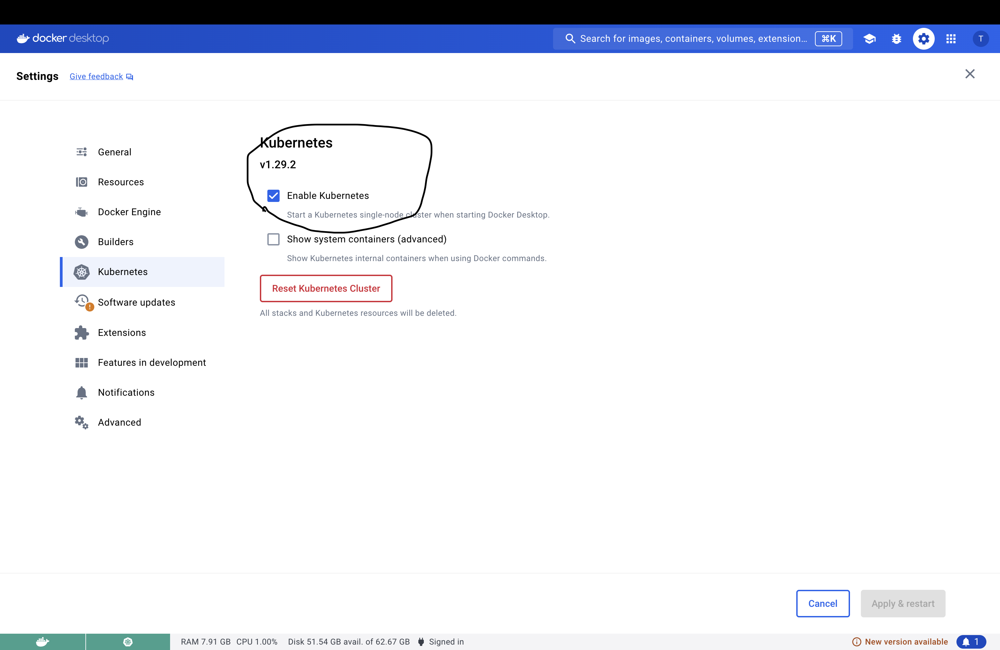

# STILL WORKING ON THIS PRJOECT 

# ApiWeatherApp
This project implements a Python Flask application that leverages an API to retrieve real-time weather data from around the globe. The application provides a user-friendly interface to access weather information conveniently.

Key Technologies:

* Python: The backend development language for the Flask 
application.

* Flask: A lightweight web framework for building web applications in Python.

* API: An interface for retrieving weather data from a chosen provider.

* Jenkins: A continuous integration and continuous delivery (CI/CD) tool used to automate the build, test, and deployment 
process.

* Argo CD: A GitOps continuous delivery tool for Kubernetes deployments, ensuring application consistency and rollbacks when necessary.

* Kubernetes (K8s): An open-source container orchestration platform for managing containerized applications.

* Docker: A containerization platform for creating and deploying applications as standardized units. 

## Pre requisuts 
* Docker 
* Docker Desktop
* kubectl
* kubens 


## Set up Kubernetes cluster

## Enable kubernets on Docker Desktop

Open docker desktop on your computer, then go to setting then Kubernetes and enable Kubernetes



## deploy Jenkins server on k8s

``` 
cd backend/k8s
```

`Note:` edit jenkins-secret.yaml and add your own credentials

apply the secret file and configmap file 

``` 
kubectl apply -f jenkins-secret.yaml
kubectl apply -f jenkins-casc-configmap.yaml
```

`Note:` make sure to edit deployment file with your own volumes 

apply the deployment file 

```
kubectl apply -f jenkins-deployment.yaml
```

you should be able to access jenkins server on port 30000


# Installing ArgoCD on Kubernetes

This guide outlines the steps to install ArgoCD on a Kubernetes cluster and access the ArgoCD server.

## Prerequisites

- Kubernetes cluster running (e.g., Minikube, Docker Desktop with Kubernetes, or a cloud provider like AWS EKS, GKE)
- `kubectl` command-line tool installed and configured to connect to your Kubernetes cluster

## Steps

### 1. Install ArgoCD using Helm

1. Add the ArgoCD Helm repository:
   ```bash
   helm repo add argo-cd https://argoproj.github.io/argo-helm
   helm repo update 
   ```

2. Create a namespace for ArgoCD (optional if not using an existing namespace):

```
kubectl create namespace argocd
```
3. Install ArgoCD using Helm:
```
helm install argocd argo-cd/argo-cd -n argocd
```
## 2. Accessing the ArgoCD Server

1. Wait for all ArgoCD pods to start and become ready:
```
kubectl get pods -n argocd
```
2. Port-forward the ArgoCD server service to your local machine:

```
kubectl port-forward svc/argocd-server -n argocd 8080:443
```
3. Open your web browser and go to https://localhost:8080. You should see the ArgoCD login screen.

4. Login using the default username and password:
* Username: `admin`
* Password: Retrieve the password using:
```
kubectl -n argocd get secret argocd-initial-admin-secret -o jsonpath="{.data.password}" | base64 -d
```
5. change the password after intial login for security. 

# Installing Prometheus and Grafana on Kubernetes using Helm

## Prerequisites

Before proceeding, ensure you have the following:

- Access to a Kubernetes cluster (version 1.16+ recommended)
- `kubectl` command-line tool configured to communicate with your cluster
- Helm 3 installed on your local machine

## Installation Steps

### 1. Install Prometheus

#### Add Prometheus Helm Repository

If you haven't added the Prometheus Helm repository yet, do so using the following command:

```bash
helm repo add prometheus-community https://prometheus-community.github.io/helm-charts
helm repo update
```
## Deploy Prometheus

Create a namespace for Prometheus (optional but recommended):

```
kubectl create namespace observation
```
Install Prometheus using Helm:

```
helm install prometheus prometheus-community/prometheus -n observation
```
## 2. Verify Prometheus Installation
Wait for all Prometheus components to be up and running. Check the pod status to ensure everything is deployed correctly:

```
kubectl get pods -n observation -l app=prometheus
```
## 3. Access Prometheus Web UI

To access the Prometheus web interface locally, set up port forwarding:

```
kubectl port-forward svc/prometheus-server -n observation 9090:80
```
Now, open your web browser and go to http://localhost:9090 to access the Prometheus UI.

## 4. install Grafana
Add Grafana Helm Repository

If you haven't added the Grafana Helm repository yet, do so using the following command:

```
helm repo add grafana https://grafana.github.io/helm-charts
helm repo update
```
Deploy Grafana

Install Grafana using Helm:

```
helm install grafana grafana/grafana -n observation
```

## 5. Verify Grafana Installation
Wait for all Grafana components to be up and running. Check the pod status to ensure everything is deployed correctly:

```
kubectl get pods -n observation -l app.kubernetes.io/name=grafana
```
## 6. access grafana dashboard

Retrieve Grafana Admin Password

Retrieve the default admin password for Grafana:

```
kubectl get secret --namespace observation grafana -o jsonpath="{.data.admin-password}" | base64 --decode ; echo
```

Access Grafana Web UI

To access the Grafana web interface locally, set up port forwarding:

```
kubectl port-forward svc/grafana -n observation 3000:80
```
Now, open your web browser and go to http://localhost:3000 to access the Grafana login page. Use admin as the username and the password retrieved earlier to log in.


# Steps to Install MongoDB
1. **create databse namespace**

```
kubectl create namespace database
```

2. **deploy mongo-secret**

`Note:` make sure to edit mongo-secret with your credentials

```
kubectl apply -f mongo-secret.yaml -n database
```

3. **Deploy MongoDB**

   Create or apply the MongoDB deployment and service YAML:

   ```
   kubectl apply -f mongodb-deployment.yaml -n database
   ```

   4. **Verify MongoDB Deployment**

   Check if MongoDB pods are running:
   ```
   kubectl get pods -n database
   ```

   Ensure the MongoDB service is created:

   ```
   kubectl get svc -n database
   ```

   ## Connect to MongoDB

Connect to MongoDB using mongosh CLI

```
mongosh --host <mongodb-service-ip> --port <mongodb-service-port> --username admin --password password --authenticationDatabase admin
```
