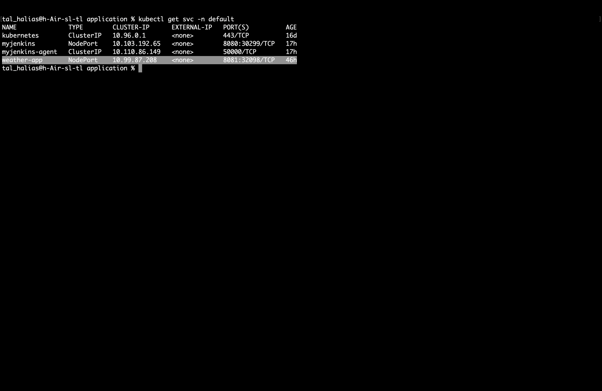
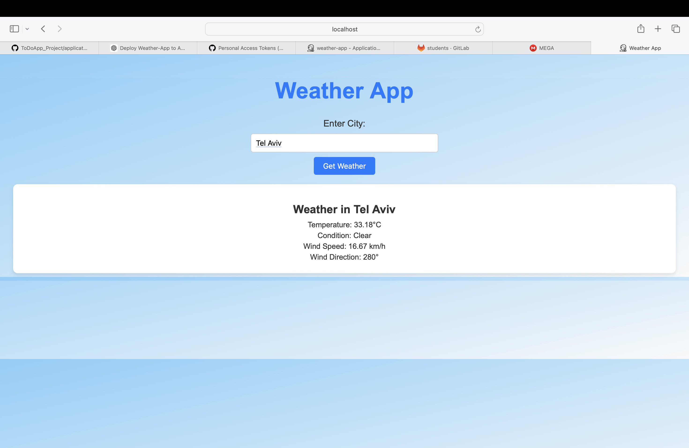
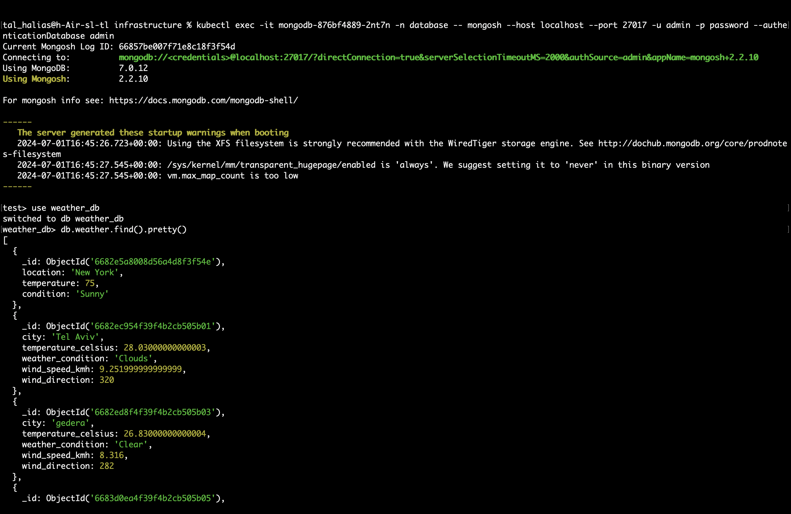
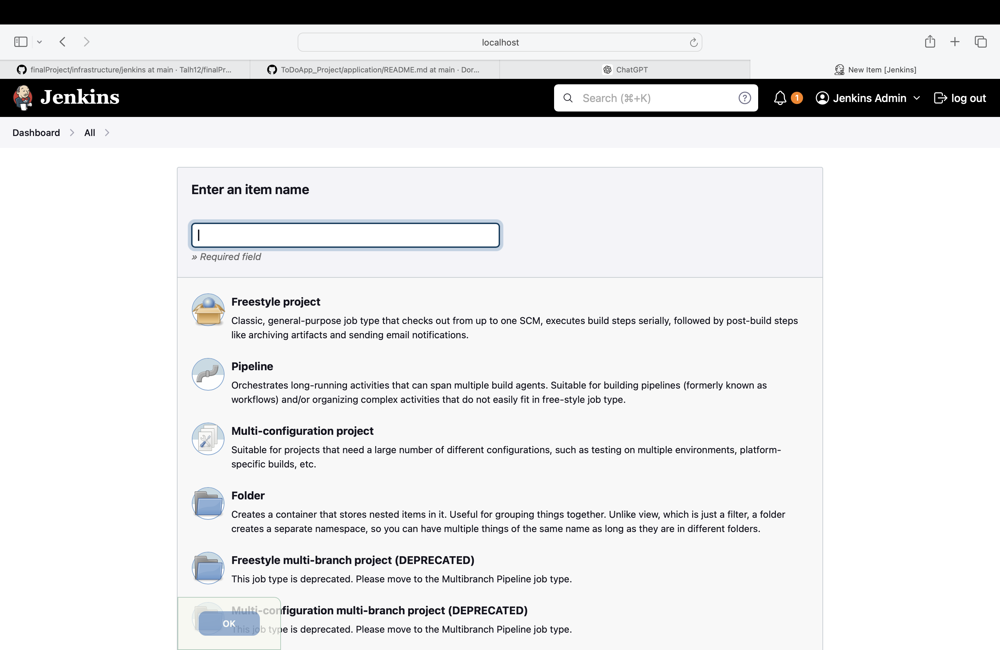
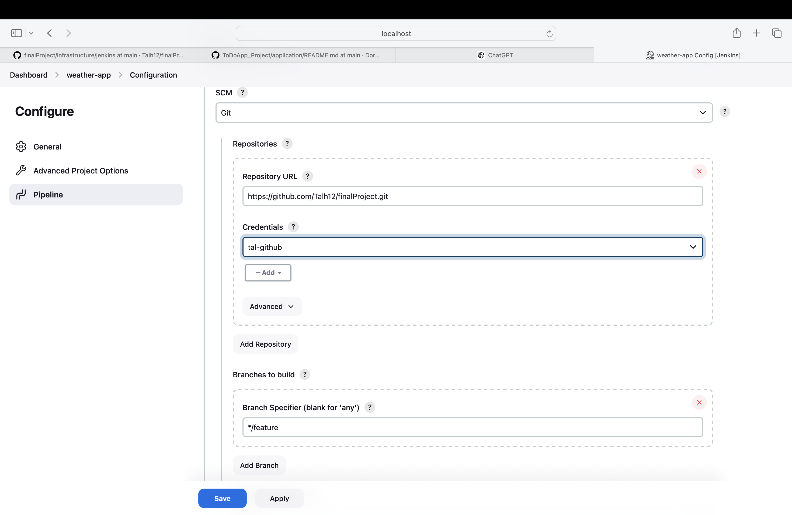
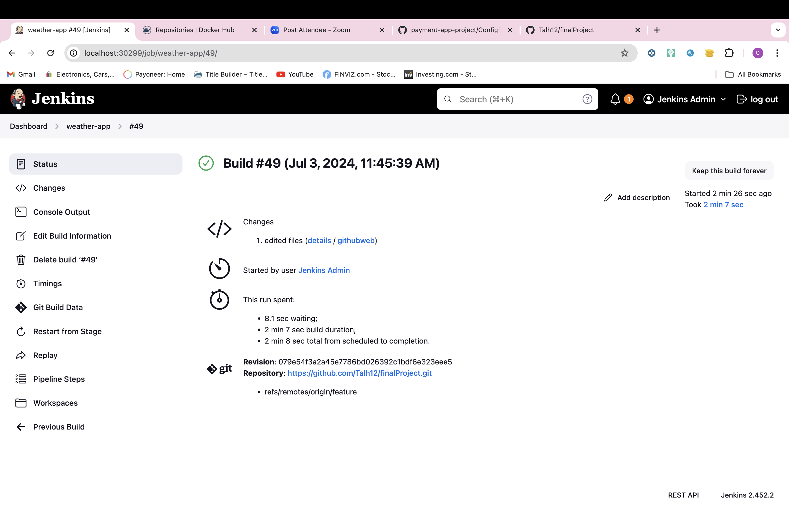
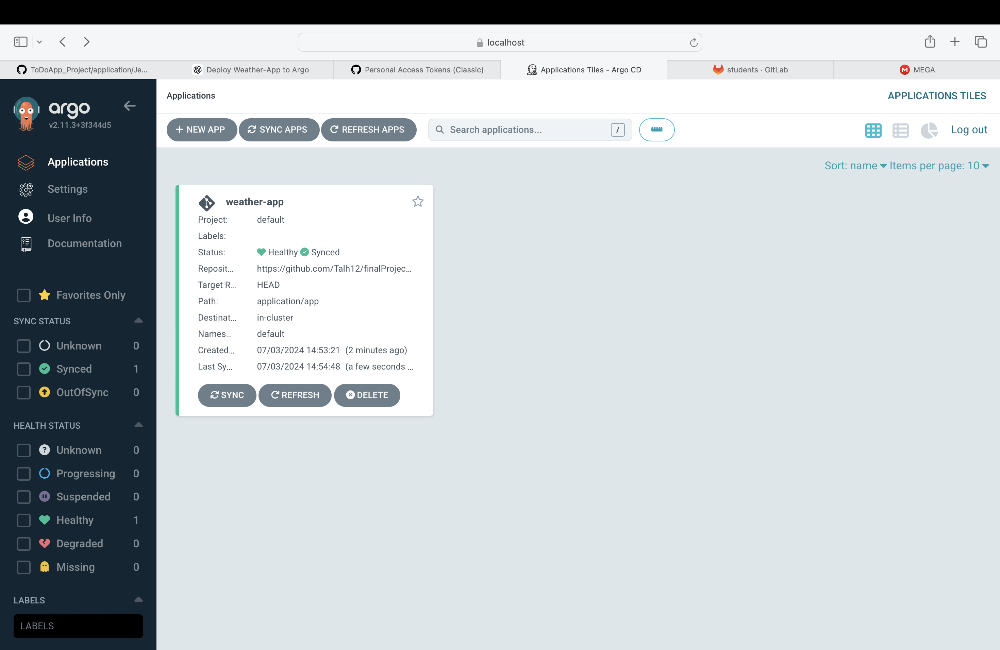
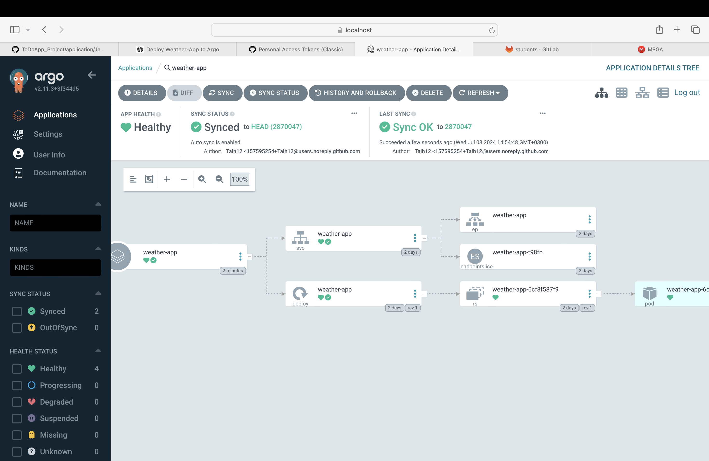

# Weather Application Deployment Pipeline

## Overview

This README provides an overview of an end-to-end CI/CD pipeline for deploying a Flask application connected to MongoDB in a Kubernetes environment. The pipeline leverages Jenkins for continuous integration, Docker for containerization, Helm for package management, and Argo CD for GitOps-based continuous deployment.

**Technologies Used:**
- **Kubernetes**: Container orchestration platform.
- **Docker**: Containerization technology.
- **Flask**: Python web framework.
- **MongoDB**: NoSQL database.
- **Jenkins**: Automation server for continuous integration.
- **Argo CD**: Declarative GitOps continuous delivery tool.

## Prerequisites

Ensure you have a functional application and have followed the setup instructions in the previous README to verify your application locally.


## Structure and Essential Files

```
├── Dockerfile
├── Dockerfile.test
├── README.md
├── __pycache__
│   └── test_main.cpython-312-pytest-8.2.2.pyc
├── app
│   ├── Jenkinsfile
│   ├── README.md
│   ├── __pycache__
│   │   └── main.cpython-312.pyc
│   ├── app-deployment.yaml
│   ├── index.html
│   └── main.py
├── argocd-deploy.yaml
├── docker-compose.yaml
├── jenkins-agent.yaml
├── requirements.txt
├── test_main.py
└── tests
    └── README.md
```

## Jenkins Agent Configuration

The `jenkins-agent.yaml` file defines a Kubernetes pod named `jenkins-agent-pod` running a container (`dind`) with Docker capabilities in a privileged security context.

## Deploy Weather-app Application

```bash
cd app
kubectl apply -f app-deployment.yaml -n default

```
### Verify Successful Deployment

```
kubectl get pods -n default 
```

### access aplication 

```
kubectl get svc -n default
```

Access the application using the weather-app service port:


access the application at:
```
localhsot:32098
```


## verify that mongodb data

Use the following command with your MongoDB credentials to check if data is being received from your application:

```
kubectl exec -it mongodb-876bf4889-2nt7n -n database -- mongosh --host localhost --port 27017 -u <username> -p <password> --authenticationDatabase admin
```
Inside the MongoDB pod, use these commands: 

```
show dbs
use weather_db
show collections
db.weather.find().pretty()
```

you should see your application data inside mongodb 



## continunes integration with jenkins 

Access the Jenkins dashboard (refer to infrastructure/jenkins/README.md if needed).

on jenkins dashboard
### create new pipeline job 

Select "New Item" and create a new pipeline job:



### configure your pipeline 
Scroll down and select "Pipeline script from SCM". 

Configure with the following settings:
 


### run build 
Click "Build Now" to start the build process. Monitor the build status:



## jenkins summarize

Jenkins automates the CI pipeline, integrating unit tests, Docker image builds, and deployment to Kubernetes. It ensures code quality and consistency before deployment.

## continunes delivery with ArgoCD

Access the Argo CD server (refer to infrastructure/argocd/README.md if needed).

## conifgure argocd to use github 

Deploy the application to Argo CD:

```
kubectl apply -f argocd-deploy.yaml -n argocd
```

### Monitor Your Application in Argo CD 




## argocd summarize

Argo CD provides GitOps-based continuous delivery, ensuring applications are automatically synchronized with Git repositories. It simplifies and automates deployment workflows in Kubernetes environments.

## Summary
This README outlines an end-to-end CI/CD pipeline for deploying a Flask application connected to MongoDB in Kubernetes. It integrates Jenkins for CI, Docker for containerization, Helm for package management, and Argo CD for GitOps-based continuous deployment. The document includes setup instructions, essential files structure, deployment steps, verification procedures, and configuration guides for Jenkins and Argo CD.