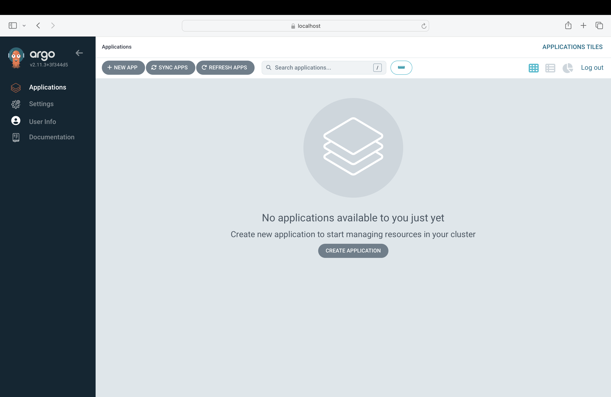

# Installing ArgoCD on Kubernetes

This guide outlines the steps to install ArgoCD on a Kubernetes cluster and access the ArgoCD server.

## Prerequisites

- Kubernetes cluster running (e.g., Minikube, Docker Desktop with Kubernetes, or a cloud provider like AWS EKS, GKE)
- `kubectl` command-line tool installed and configured to connect to your Kubernetes cluster

## Steps

### 1. Install ArgoCD using Helm

1. Add the ArgoCD Helm repository:
   ```bash
   helm repo add argo-cd https://argoproj.github.io/argo-helm
   helm repo update 
   ```

2. Create a namespace for ArgoCD (optional if not using an existing namespace):

```
kubectl create namespace argocd
```
3. Install ArgoCD using Helm:
```
helm install argocd argo-cd/argo-cd -n argocd
```
## 2. Accessing the ArgoCD Server

1. Wait for all ArgoCD pods to start and become ready:
```
kubectl get pods -n argocd
```
2. Port-forward the ArgoCD server service to your local machine:

```
kubectl port-forward svc/argocd-server -n argocd 8080:443
```
3. Open your web browser and go to https://localhost:8080. You should see the ArgoCD login screen.


4. Login using the default username and password:
* Username: `admin`
* Password: Retrieve the password using:
```
kubectl -n argocd get secret argocd-initial-admin-secret -o jsonpath="{.data.password}" | base64 -d
```
5. Access argocd dashboard
