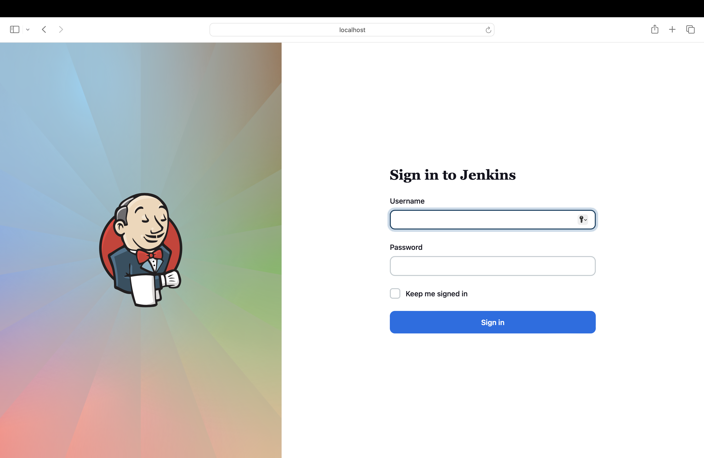

# deploy Jenkins server on k8s


`Note:` edit jenkins-secret.yaml and add your own credentials

apply the secret file and configmap file 

``` 
kubectl apply -f jenkins-secret.yaml
kubectl apply -f jenkins-casc-configmap.yaml
```

`Note:` make sure to edit deployment file with your own volumes 

apply the deployment file 

```
kubectl apply -f jenkins-deployment.yaml
```

## Access jenkins on port 30000
 

