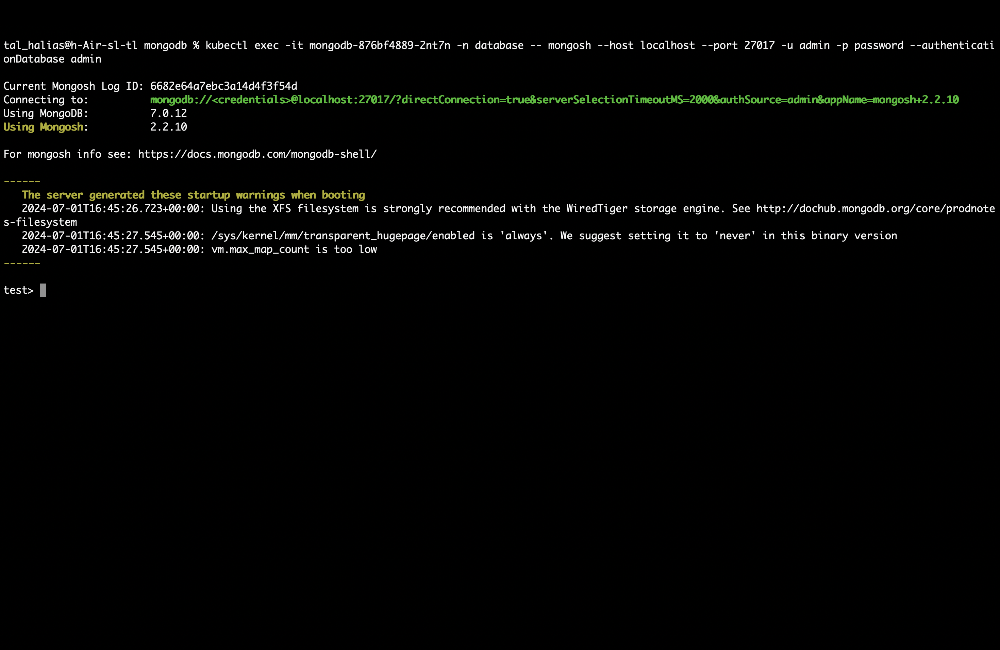

1. **create databse namespace**

```
kubectl create namespace database
```

2. **deploy mongo-secret**

`Note:` make sure to edit mongo-secret with your credentials

```
kubectl apply -f mongo-secret.yaml -n database
```

3. **Deploy MongoDB**

   Create or apply the MongoDB deployment and service YAML:

   ```
   kubectl apply -f mongodb-deployment.yaml -n database
   ```

   4. **Verify MongoDB Deployment**

   Check if MongoDB pods are running:
   ```
   kubectl get pods -n database
   ```

   Ensure the MongoDB service is created:

   ```
   kubectl get svc -n database
   ```

   ## Connect to MongoDB

Connect to MongoDB using mongosh CLI

```
mongosh --host <mongodb-service-ip> --port <mongodb-service-port> --username admin --password password --authenticationDatabase admin
```

this is what you should see 

