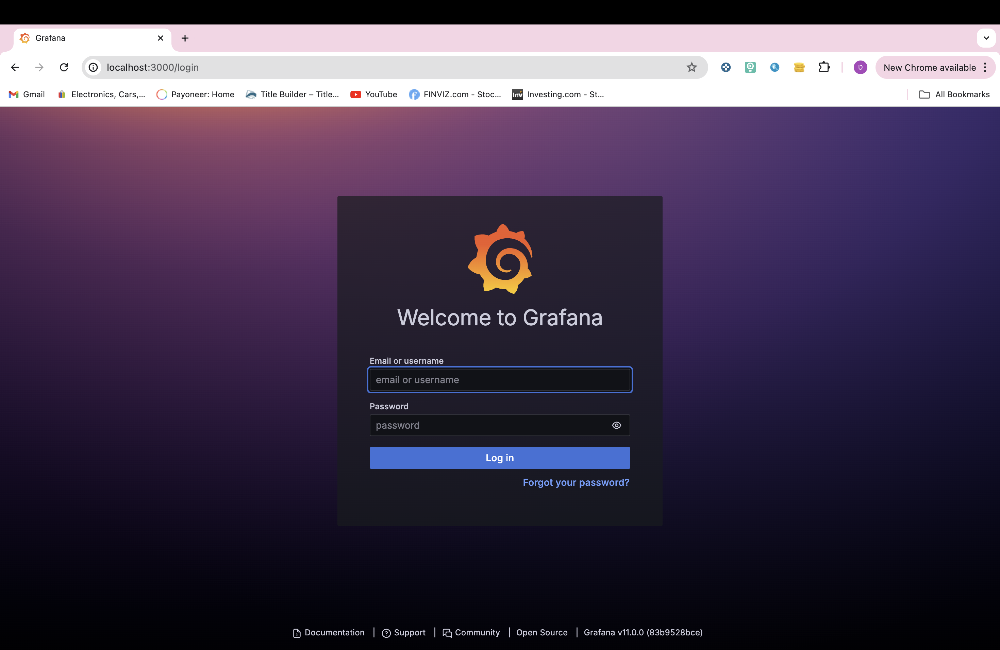
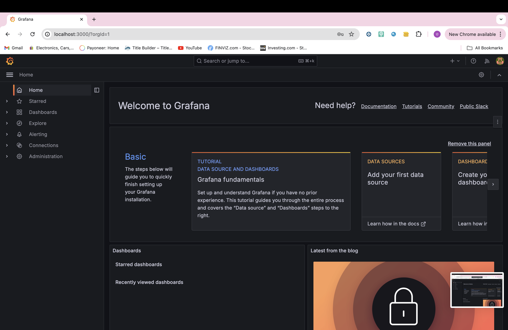

# Installing Prometheus and Grafana on Kubernetes using Helm

## Prerequisites

Before proceeding, ensure you have the following:

- Access to a Kubernetes cluster (version 1.16+ recommended)
- `kubectl` command-line tool configured to communicate with your cluster
- Helm 3 installed on your local machine

## Installation Steps

### 1. Install Prometheus

#### Add Prometheus Helm Repository

If you haven't added the Prometheus Helm repository yet, do so using the following command:

```bash
helm repo add prometheus-community https://prometheus-community.github.io/helm-charts
helm repo update
```
## Deploy Prometheus

Create a namespace for Prometheus :

```
kubectl create namespace monitoring
```
Install Prometheus using Helm:

```
helm install prometheus prometheus-community/prometheus -n monitoring
```
## 2. Verify Prometheus Installation
Wait for all Prometheus components to be up and running. Check the pod status to ensure everything is deployed correctly:

```
kubectl get pods -n monitoring -l app=prometheus
```
## 3. Access Prometheus Web UI

To access the Prometheus web interface locally, set up port forwarding:

```
kubectl port-forward svc/prometheus-server -n monitoring 9090:80
```
Now, open your web browser and go to http://localhost:9090 to access the Prometheus UI.

## 4. install Grafana
Add Grafana Helm Repository

If you haven't added the Grafana Helm repository yet, do so using the following command:

```
helm repo add grafana https://grafana.github.io/helm-charts
helm repo update
```
Deploy Grafana

Install Grafana using Helm:

```
helm install grafana grafana/grafana -n monitoring
```

## 5. Verify Grafana Installation
Wait for all Grafana components to be up and running. Check the pod status to ensure everything is deployed correctly:

```
kubectl get pods -n monitoring -l app.kubernetes.io/name=grafana
```
## 6. access grafana dashboard

Retrieve Grafana Admin Password

Retrieve the default admin password for Grafana:

```
kubectl get secret --namespace monitoring grafana -o jsonpath="{.data.admin-password}" | base64 --decode ; echo
```

Access Grafana Web UI

To access the Grafana web interface locally, set up port forwarding:

```
kubectl port-forward svc/grafana -n monitoring 3000:80
```
Now, open your web browser and go to http://localhost:3000 to access the Grafana login page. Use admin as the username and the password retrieved earlier to log in.


after siging in you should be able to use the grafna daashboard 

